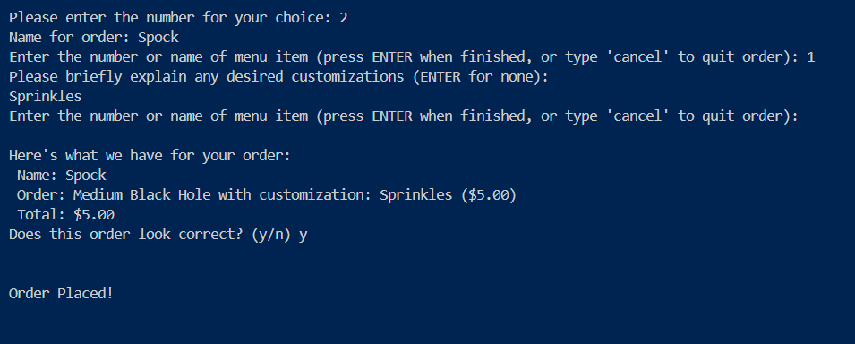

## Bearcat Bistro Ordering System

**Data Structure Choices**

__**Menu:**__ I chose to use an array to contain the menu, since my program accessed the drinks by assigning each a number. The indexing system of an array made the numbering simpler, and the time complexity for accessing an item in this fashion was constant. I also included an option for accessing the drinks by name which could have been made simpler by using a datastructure like a dictionary, and using drink names as keys. This was a tradeoff of using the array. 

__**Customer Order/Order Confiramtion:**__ I stored the customer order in a specific CustomerOrder object. This included a string for the name associated with an order and a linked list to hold its drink objects. This class was designed to print out for order confirmation as well, making use of the same data reference. Using a linked list provided a flexibility that was useful in adding to and removing from the order, simplifying memory useage while frequently expanding and contracting the list. On the few occasions where an object has to be located in the list, this process has time complexity O(n) as the linked list requires iteration. This is a trade off of the strucutre, however as the use of the linked list is to hold drink orders, it is unlikely it will grow very large, probably remaining under 10 items in most situations.

__**Open Orders:**__ I used a Deque to store the open orders. It makes sense to use a data structure which can imitate a queue for orders which will be put in a line to be completed one at a time, similar to the first-in-first-out pattern. The Deque has the advantage of being able to cancel or edit orders after they have been added to the queue. This structure allows for constant time complexity access to its head and tail, the elements which will matter the most in this situation. In a real world bistro, drinks can be finished slightly out of order if different baristas are making them, which poses an issue with this implementation, as only the first drink in line can be marked as complete. In an ideal situation however, it works well. 

__**Completed Orders:**__ The completed order structure was implemented as a bag containing the individual drinks from each order. This served for simple calculations on the end of day report, as the numbers of each drink sold were already tallied, and the information customer names was no longer needed. Though the time complexity to iterate the bag and obtain the number of each drink sold is O(n), the n represents the generic drink types from the menu, not every single drink ordered in the day. For this reason, using this structure greatly simplifies the process. If, for future reference, the additional information from each order was needed (such as name of customer), this system would fail, and another data structure would be needed to hold the individual orders. 

**Sample Output**

**Limitations/ Next Steps**
There are currently no known bugs in my code, there are several limitations however. When editing an order, the user can't add to the order without removing a drink. Also, when the user removes a drink, it simply takes the first drink with the given name. With more time, I would like to restructure the order editing function to have more functionality such as being able to change customization, choose to remove specific drinks of a type, and maneuver in and out of editing more easily. 

In general, the exiting processes could be more specific and easy to use. I would like to improve the visual layout, and implement some of the extensions such as saving daily reports and creating accounts, as well. 